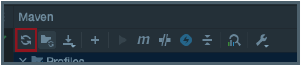
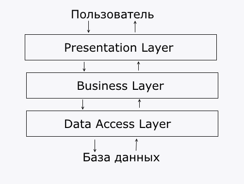
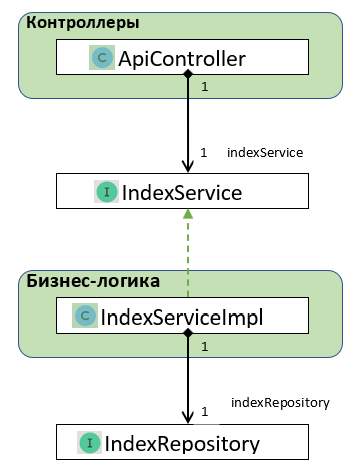

# SearchBot
## Описание проекта

Проект локального поискового движка по сайту с подключенными библиотеками 
лемматизаторами. Содержит несколько контроллеров, сервисов и репозиториев
с подключением к БД MySQL. Поисковый движок представляет собой Spring-приложение
(JAR-файл, запускаемый на любом сервере или компьютере), работающее с
локально установленной базой данных MySQL, имеющее простой
веб-интерфейс и API, через который им можно управлять и получать
результаты поисковой выдачи по запросу.

## Настройки для запуска

### Зависимости

В зависимостях в файле `pom.xml` добавлен репозиторий с исходными
кодами и сгенерированными JAR-библиотеками, предназначенными для
лемматизации слов:

```xml
<repositories>
  <repository>
    <id>skillbox-gitlab</id>
    <url>https://gitlab.skillbox.ru/api/v4/projects/263574/packages/maven</url>
  </repository>
</repositories>
```
Также в файле pom.xml в разделе с зависимостями добавлены все
библиотеки из данного репозитория:

```xml
<dependency>
    <groupId>org.apache.lucene.morphology</groupId>
    <artifactId>morph</artifactId>
    <version>1.5</version>
</dependency>
<dependency>
    <groupId>org.apache.lucene.analysis</groupId>
    <artifactId>morphology</artifactId>
    <version>1.5</version>
</dependency>
<dependency>
    <groupId>org.apache.lucene.morphology</groupId>
    <artifactId>dictionary-reader</artifactId>
    <version>1.5</version>
</dependency>
<dependency>
    <groupId>org.apache.lucene.morphology</groupId>
    <artifactId>english</artifactId>
    <version>1.5</version>
</dependency>
<dependency>
    <groupId>org.apache.lucene.morphology</groupId>
    <artifactId>russian</artifactId>
    <version>1.5</version>
</dependency>
```
Для публичного доступа к библиотекам необходимо указать токен. Для этого найдите 
или создайте файл `settings.xml`.

* В Windows он располагается в директории `C:/Users/<Имя вашего пользователя>/.m2`
* В Linux — в директории `/home/<Имя вашего пользователя>/.m2`
* В macOs — по адресу `/Users/<Имя вашего пользователя>/.m2`

Если файла settings.xml нет, создайте его и вставьте в него код:
```xml
<settings xmlns="http://maven.apache.org/SETTINGS/1.0.0"
xmlns:xsi="http://www.w3.org/2001/XMLSchema-instance"
xsi:schemaLocation="http://maven.apache.org/SETTINGS/1.0.0
https://maven.apache.org/xsd/settings-1.0.0.xsd">
  
<servers>
    <server>
        <id>skillbox-gitlab</id>
        <configuration>
            <httpHeaders>
                <property>
                    <name>Private-Token</name>
                    <value>wtb5axJDFX9Vm_W1Lexg</value>
                </property>
            </httpHeaders>
        </configuration>
    </server>
</servers>
</settings>
```
Если файл уже есть, но в нём нет блока <servers>, то добавьте в него
только этот блок. Если этот блок в файле есть, добавьте внутрь него блок
<server> из фрагмента кода, приведённого выше.


В блоке <value> находится уникальный токен доступа. Если у вас возникнет
«401 Ошибка Авторизации» при попытке получения зависимостей, возьмите
актуальный токен доступа [из документа по ссылке](https://docs.google.com/document/d/1rb0ysFBLQltgLTvmh-ebaZfJSI7VwlFlEYT9V5_aPjc/edit).

Обязательно почистите кэш maven. Самый надёжный способ — удалить
директорию:
* Windows: C:\Users\<user_name>\.m2\repository
* macOs: /Users/<user_name>/.m2/repository
* Linux: /home/<user_name>/.m2/repository
    
<user_name> — имя пользователя, под которым вы работаете.

После этого снова попробуйте обновить данный из pom.xml.

Затем обновите зависимости в проекте при помощи (Ctrl+Shift+O / ⌘⇧I) или
принудительно обновите данные из pom.xml.



Код лемматизатора работает следующим образом:

```java
LuceneMorphology luceneMorph = new RussianLuceneMorphology();
List<String> wordBaseForms = luceneMorph.getNormalForms("леса");
wordBaseForms.forEach(System.out::println);
```
Данный код выведет следующие строки (две возможные исходные
формы слова «леса»):
```text
лес
леса
```

Часть речи определяется так:

```java
LuceneMorphology luceneMorph = new RussianLuceneMorphology();
List<String> wordBaseForms = luceneMorph.getMorphInfo("или");
wordBaseForms.forEach(System.out::println);
```

Такой код выдаст следующую информацию:

```text
или|n СОЮЗ`
```

### Настройки подключения к БД

В проект добавлен драйвер для подключения к БД MySQL. Для запуска проекта,
убедитесь, что установлен и запущен сервер MySQL 8.x.

🐳 Если установлен докер, можете запустить контейнер с готовыми настройками
под проект командой:

```bash
docker build --tag=searchbot:latest .
docker run -d --name=searchEngine -p 7777:8080 searchbot:latest
```

Имя пользователя по-умолчанию `root`, настройки проекта в `src/resources/application.yaml`
соответствуют настройкам контейнера, менять их не требуется.

Если используете MySQL без докера, то создайте БД `search_engine` и замените логин и пароль
в файле конфигурации `src/resources/application.yaml`:

```yaml
spring:
  datasource:
    username: root # имя пользователя
    password: MySqL_pswrd7 # пароль пользователя
```

После этого можно запустить проект. Если введены правильные данные,
проект успешно запустится. Если запуск заканчивается ошибками, изучите текст
ошибок, внесите исправления и попробуйте заново.

## Структура проекта

Будем придерживаться простой слоистой структуре (другое название - "луковичная"). 
Есть три слоя:

* **Presentation** - это контроллеры. Слой общается с пользователями, в данном случае ожидает запросы
по API и возвращает ответы.
* **Business** - самый важный слой - бизнес логика, содержится в классах Сервисах. Этот слой ничего 
не знает о Presentation-слое
* **Data Access** - это классы Репозитории. Слой отвечает за хранение данных, подключение к БД, 
реализацию запросов. Слой ничего не знает о других слоях.



Каждый слой занимается только своими задачами и работа одного слоя не должна перетекать в другой. Например, Контроллер
должен только получать данные от пользователя и вызывать нужный сервис, не более. Все расчеты и проверки должны быть в
классах сервисах.

Если посмотреть слои данного приложения, то увидим не только сами классы, но еще и интерфейсы между ними.



Интерфейсы нужны, чтобы слои приложения не зависели от реализаций классов. Каждый из классов ApiController и
IndexServiceImpl зависят от интерфейса IndexService. Это значит, что сервисы и контроллеры могут меняться
независимо, заменяться и это не будет влиять на другие слои.

Также это относится и к передаваемым данным, у каждого слоя
может быть свои структуры для хранения данных, например Репозитории отдают Entity классы, а сервисы уже упаковывают в
нужные объекты, снова для того, чтобы конечный потребитель данных не зависел напрямую от структуры данных в БД. БД может
измениться, поменять структуру таблиц - и это должно произойти максимально незаметно для других слоев.

Если еще раз посмотреть на схему, самой реализации "Data Access"-слоя нет, в проекте есть только интерфейс репозитория, 
а реализация будет сгенерирована при запуске проекта.

## Стек используемых технологий
В данном проекте используются следующие технологии:
* Spring Boot
* Hibernate
* JPA
* Thymeleaf
* MySQL
* JSoup
* Lombok
* Docker
* Apache Log4j 2


## Инструкция по локальному запуску проекта

Выполнить сборку проекта Maven -> Lifecycle -> package. После сборки проекта запустить его из окна терминала, выполнив 
команду:
```bash
java -jar SearchBot-0.0.1-SNAPSHOT.jar
```
Либо после сборки проекта создать образ Docker командой:

```bash
docker build --tag=searchbot:latest .
```
И затем выполнить запуск контейнера:

```bash
docker run -d --name=searchEngine -p 7777:8080 searchbot:latest
```